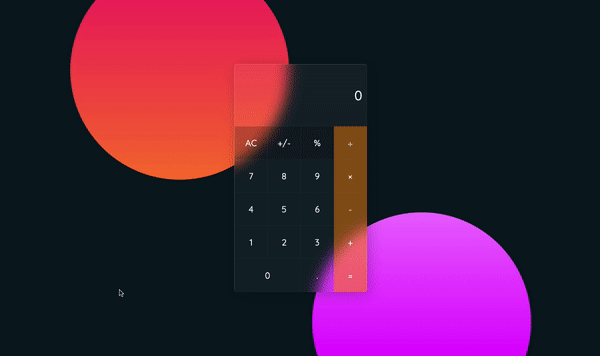
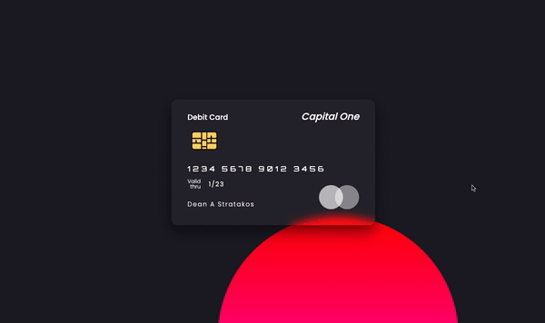
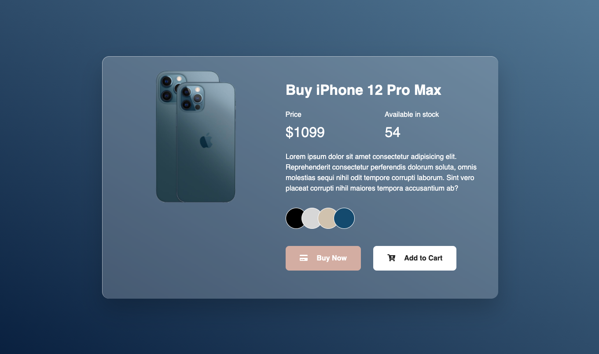

# Glassmorphism

## Dean Stratakos

### December 29, 2020

This repository is a collection of [glassmorphism](https://uxdesign.cc/glassmorphism-in-user-interfaces-1f39bb1308c9)
effects to experiment with different use cases.

    <h4>Landing page</h4>
    
    <h4>Contact cards</h4>
    
    <h4>Calculator</h4>
    
    <h4>Debit card with flip animation</h4>
    
    <h4>Frosted glass floating panel</h4>
    
    <h4>Contact cards</h4>
    
    <h4>iPhone product page</h4>
    
    <h4>Animated cards</h4>
    

## Resources

1. [Real Glassmorphism Card Hover Effects](https://youtu.be/hv0rNxr1XXk)

2. [SemiTransparent 3D Flip Debit Card UI Design using Html & CSS Only | Glassmorphism Effects](https://youtu.be/XeX1vsaufF0)

3. [CSS Frosted Glass Effect using backdrop-filter | CSS Blurred Glass  Effect](https://youtu.be/-2mkoKVbmGg)

4. [Creative Our Team Section Using HTML & CSS | CSS Glassmorphism Card Hover Effects](https://youtu.be/Q22Tli-D4mw)

5. [Build A Responsive Website with Animation From Scratch using Html CSS & Javascript](https://youtu.be/YRAoM4-Eb4A)

6. [Glassmorphism Product card Design using HTML and CSS](https://www.youtube.com/watch?v=BwNoYkiq6v4)

7. [CSS Glass Morphism User Card Interactions | Glassmorphism UI Design](https://www.youtube.com/watch?v=TN4DoHiWrQQ)

8. [How to make Calculator With JavaScript | CSS Glassmorphism Effects | Glass morphism](https://www.youtube.com/watch?v=NhcZh8Bwr30)

9. [How to build a calculator - part 2](https://zellwk.com/blog/calculator-part-2/?ck_subscriber_id=1122863103)